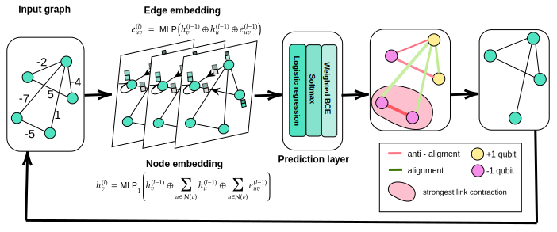
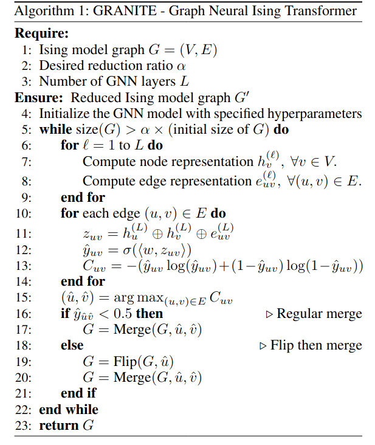

# Scalable Quantum-Inspired Optimization through Dynamic Qubit Compression

> URL : https://arxiv.org/abs/2412.18571

## 1. Background

### 1.1. Related Work 
- **Ising Models & NP-Hard Problems**  
  - **Ising Hamiltonian**:  
    $$H = -\sum_{i,j} J_{ij} s_i s_j - \sum_i h_i s_i, \quad s_i \in \{-1, +1\}$$

    The energy function defines interactions between spins. The goal is to minimize $H$, which leads to finding the ground state configuration.

  - **QUBO Formulation**:  
    $$\min_{x} \sum_{i,j} Q_{ij} x_i x_j + \sum_i c_i x_i, \quad x_i \in \{0,1\}$$

    QUBO is equivalent to Ising models in its ground state, where the optimal solutions correspond to the ground state (lowest-energy) configurations of the Ising system, with $s_i = 2x_i - 1$, mapping combinatorial problems to quantum hardware.

- **Quantum Annealing (QA)**  
  - Adiabatic Evolution:  

### 1.2. Motivation
- Qubit limitation in quantum hardware (D-Wave ≤ 5,640 qubits).  
- Existing reduction methods not tunable.   

## 2. Method  

A GNN model is trained to classify edges (i.e not directly trained to compress graphs). Compression happens in a separate iterative process that applies the trained GNN model.

The model is trained on small graphs and inferred on large graphs, and still achieves good results. This is validated by comparing the full graph's solution vs. the compressed graph's solution on D-Wave.

### 2.1. Dataset Generation and GNN Training

The Ising models are created as a weighted graph $G = (V, E)$. 

- **Nodes ($V$)** represent spins $s_i$.  
- **Edges ($E$)** exist if $J_{ij} \neq 0$, representing spin interactions.  

1. Edge Weights:  
   - Interaction strength $J_{ij}$ is encoded as edge weight: $w(i, j) = J_{ij}$
   - External field $h_i$ is encoded as one virtual node $v_0$:  $w(0, i) = h_i$

2. Node Features: Each node $i$ is assigned:  
   - Degree: $\deg(i)$  
   - Weighted degree: $\sum_{j \in \mathcal{N}(i)} |J_{ij}|$  
   - Absolute weighted degree: $\sum_{j \in \mathcal{N}(i)} J_{ij}$  

3. Labels: Ground states are determined using **Gurobi MIQP solver** (Mixed-Integer Quadratic Programming). Edge labels are assigned based on ground state alignments:
- **Alignment** ($s_i = s_j$ in all ground states) → **Merge**  
- **Anti-alignment** ($s_i = -s_j$ in all ground states) → **Flip-Merge**  
- **Neutral** (State varies across ground states) → **No merge** 

4. Graph Types:  
   - Instances generated using **Erdős-Rényi (ER)**, **Barabási-Albert (BA)**, and **Watts-Strogatz (WS)** models.  
   - Sizes range upto 26 nodes for training.  

Edge classification is **Co-NP-hard**, motivating the use of a Graph Neural Network (GNN) for prediction.

The GNN model learns node and edge representations iteratively through message passing. The update rules for nodes and edges at layer $\ell$ are:
$$h_v^{(\ell)} = \text{MLP}_1 \left( h_v^{(\ell-1)} \oplus \sum_{u\in \mathcal{N}(v)}  h_{u}^{(\ell-1)} \oplus\sum_{u\in \mathcal{N}(v)} e_{v, u}^{(\ell-1)} \right)$$

$$e_{uv}^{(\ell)} =  \text{MLP}_2\left(h_u^{(\ell-1)} \oplus h_v^{(\ell-1)} \oplus e_{uv}^{(\ell-1)}\right)$$

For each edge, the model predicts whether edges' alignment i.e should be merged or flip-merged:
$$z_{uv} = h_u^{(L)} \oplus h_v^{(L)} \oplus e_{uv}^{(L)}$$

$$\hat{y}_{uv} = \sigma(\langle w, z_{uv} \rangle)$$

Confidence-weighted loss function is used:
$$c_i = \frac{\exp\left(|\hat{y}_{i} - 0.5| / T\right)}{\sum_{j} \exp\left(|\hat{y}_{j} - 0.5| / T\right)}$$

$$w_i = \lambda \cdot c_i + (1 - \lambda)$$

$$\mathcal{L} = \sum_{i} w_i \left( -y_i \log(\hat{y}_i) - (1 - y_i) \log(1 - \hat{y}_i) \right)$$

### 2.2. Compression Phase  

After training, the GNN is used in a separate iterative process to reduce the Ising model.

(Sizes of testing dataset includes larger graphs (e.g., up to 400 nodes). D-Wave QA is used to find the ground-state.) 

**The compression algorithm applies the following operations:**
- **Merge Operation** (for aligned spins):  
  $$w(i, k) = w(i, k) + w(j, k)$$

  This reduces problem size while preserving optimization structure.

- **Flip-Merge Operation** (for anti-aligned spins):  
  The sign of spin interactions is flipped before merging.

Compression continues iteratively until the desired reduction is achieved.

**Metrics for Evaluation are as follow:**

  - **Optimality**: Measures solution quality preservation after compression.
  $$\text{Optimality} = 1 - \frac{|E_{\text{best}} - E_{\text{min}}|}{|E_{\text{min}}|}$$

  $E_{\text{best}}$ is the best energy found after compression, and $E_{\text{min}}$ is the optimal energy from the full model.

  - **Qubit Reduction**: Measures the percentage of qubits saved.
  $$\text{Reduction} = 1 - \frac{q_{\text{compressed}}}{q_{\text{original}}}$$

## 3. Results & Ablation
-
  - 75% reduction still maintains 91% optimality.  
  - Significant qubit savings across all graph types.  
  - Outperforms random baseline compression strategies.  

-
    - Hybrid loss achieves best performance compared to BCE/MSE.  
    - 3-layer GNN is optimal for accuracy and generalization.  

## 4. Future Work (& Personal Ideas)

- Apply GRANITE to real-world datasets i.e (Multiplex) Influence Maximization

- New optimization i.e Reinforcement Learning
