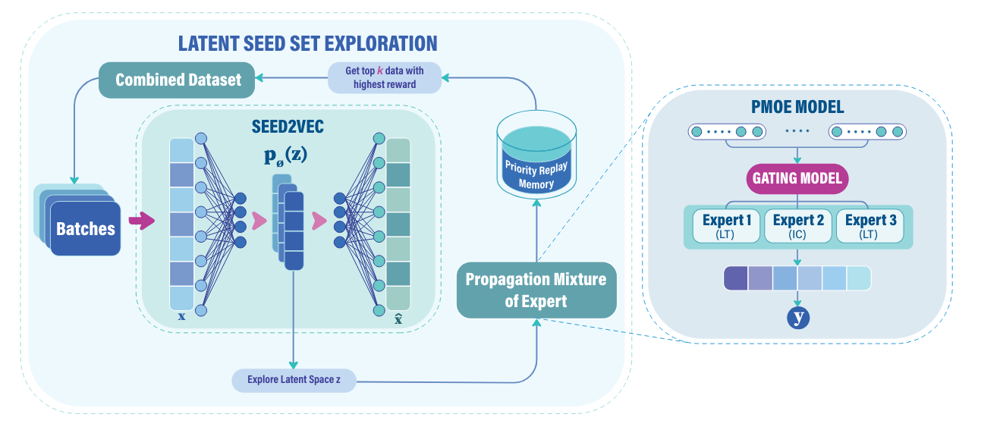

## REM: A Scalable Reinforced Multi-Expert Framework for Multiplex Influence Maximization

> URL: https://arxiv.org/pdf/2501.00779

### 1. Background

The Influence Maximization (IM) problem seeks to identify the optimal set of nodes (seed set) in a network to maximize the spread of influence under diffusion models. IM is NP-hard, with traditional greedy algorithms offering near-optimal solutions but suffering from scalability issues.

### 2. Method

The REM (Reinforced Exploration Model) framework addresses these limitations through two key components: 

> The first, PMoE (Propagation Mixture of Experts), is optimized using simulation runs to accurately predict influence spread. This trained PMoE model then serves as a reward estimator to guide the optimization of the second model, Seed2Vec, which functions as an RL agent for efficient exploration of seed sets.

#### Propagation Mixture of Experts (PMoE)

PMoE consists of multiple GNNs (experts) with different depths, each capturing different propagation dynamics. For a given seed set $x$ and graph $G$, the influence prediction is modeled as:
$$M(x, G; \xi) = \sum_{i=1}^{C} R_i(x) e_i(x, G; \xi_i)$$

where $R_i(x)$ is the routing probability for expert $i$, and $e_i$ represents the GNN output of the $i$-th expert.

#### Seed2Vec with RL-based Exploration

Seed2Vec is a Variational Autoencoder (VAE) that maps seed sets $x$ to latent representations $z$:
$$F_\theta = D_\phi(E_\psi(x)) = D_\phi(z)$$

ELBO (Evidence Lower Bound) for training:
$$\mathcal{L}_{ELBO} = \mathbb{E}_{q_\psi}[\log p_\phi(x|z)] - D_{KL}(q_\psi(z|x) || p_\phi(z))$$

Reinforcement Learning (RL) guides exploration in the latent space $z$ to find novel seed sets:
$$\mathcal{L}_{Explore}(z) = \mathbb{E} \left( c \cdot H(D_\phi(z)) + \exp(-P(D_\phi(z))) \right)$$

where $H$ is the entropy promoting diversity, and $P$ evaluates influence spread predicted by PMoE.

End-to-End Objective:
$$\mathcal{L}_{Train} = \mathbb{E}[\mathcal{L}_{ELBO} + \mathcal{L}_{PMoE} + \mathcal{L}_{Explore}]$$

### 3. Results

#### Datasets
- Cora-ML: Citation network with 2,708 nodes, 7,981 edges.
- Celegans Multiplex GPI Network: Genetic interactions in *C. elegans*, 3,879 nodes.
- Arabidopsis Network: Genetic-protein interactions in *A. thaliana*, 6,980 nodes.
- NYClimateMarch2014: Twitter dataset, 102,439 nodes.
- ParisAttack2015: Twitter dataset during the Paris attacks, 1.9M nodes.

#### Performance and Speed